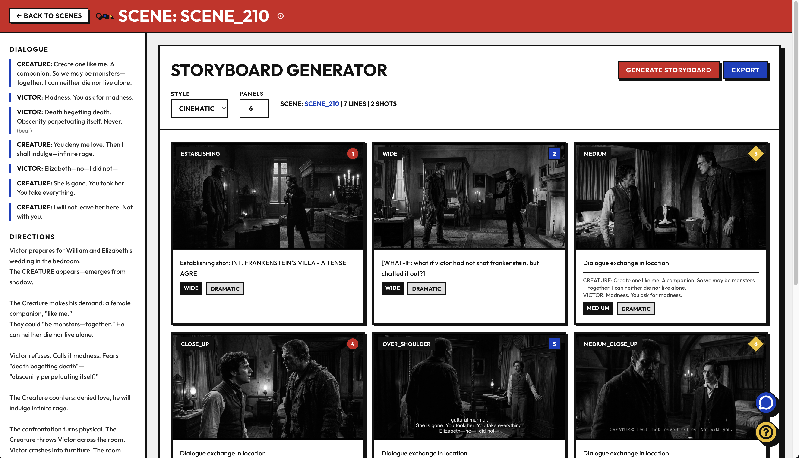
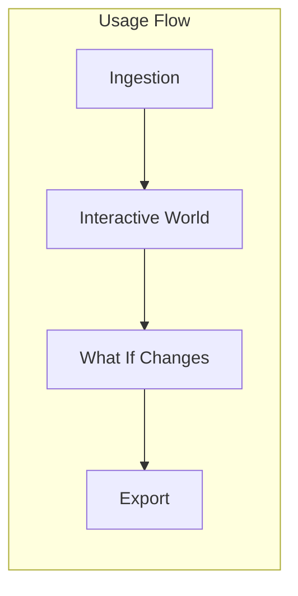

# whatif

Whatif is an AI-native local studio using a swarm to help independent filmmakers build worlds with git enabled version control, generative story board building, character development, and streamlined pipeline to video gen models.

As a filmmaker, all you have to do is ask "what if" and watch your intent be transformed into characters, story lines, and real scenes from your film.



## Usage flow

As a filmmaker, you move from raw script to explorable world to final export. The flow below guides you through each phase.



### 1. [Ingestion](docs/ingestion.md)

Import your script and build the world. The pipeline parses the script, extracts characters/scenes/locations/props, infers narrative intelligence (events, storylines, knowledge, relationships), envisions production (camera, lighting, blocking, audio), indexes everything to SQLite, and supports human review before commit. Output: a live project with characters, scenes, events, storylines, and production state ready for exploration.

### 2. [Enter interactive world](docs/interactive-world.md)

Pick a scene at a specific point in the storyline. Enter the 3D viewer where characters are present. Adjust camera, scene layout, and character positions. You can impersonate individual characters to explore their perspective. See [scene configuration](docs/scene-config.md) for camera, blocking, and lighting controls.

### 3. [Make changes to the world](docs/what-if-exploration.md)

Use natural language ("what if...") to explore alternatives. The director asserts intent; the state branches and propagates knowledge, emotional states, and world changes to downstream scenes. This is the core creative loop—explore, decide, review, commit. The state machine (IDLE → DECIDE → BRANCH → PROPAGATE → REINDEX → GENERATE) is described in [ingestion](docs/ingestion.md#state-machine-transitions).

### 4. [Export](docs/export.md)

Export scenes with assets, prompts, and metadata. Output is structured for consumption by video generation models (e.g. Veo) to produce clips. The pipeline tracks storyboards, renders, and director approvals.


## Backend (FastAPI)

Python API backend in `backend/`.

- **Framework:** FastAPI
- **Entry:** `main.py` — app instance is `app`

### Run

```bash
cd backend
fastapi dev main.py --app app
```

Or with uvicorn:

```bash
cd backend
uvicorn main:app --reload
```

### Endpoints

- `GET /` — Hello World
- `GET /items/{item_id}` — Returns `item_id` and optional query param `q`

### Setup

```bash
cd backend
pip install -r requirements.txt
```

---

## Frontend (React + Vite)

React + TypeScript app in `frontend/`.

- **Framework:** React 19
- **Build:** Vite 7
- **Entry:** `src/main.tsx` → `src/App.tsx`

### Run

```bash
cd frontend
npm run dev
```

### Scripts

- `npm run dev` — Start dev server (HMR)
- `npm run build` — Type-check and build for production
- `npm run preview` — Preview production build
- `npm run lint` — Run ESLint

### Setup

```bash
cd frontend
npm install
```
